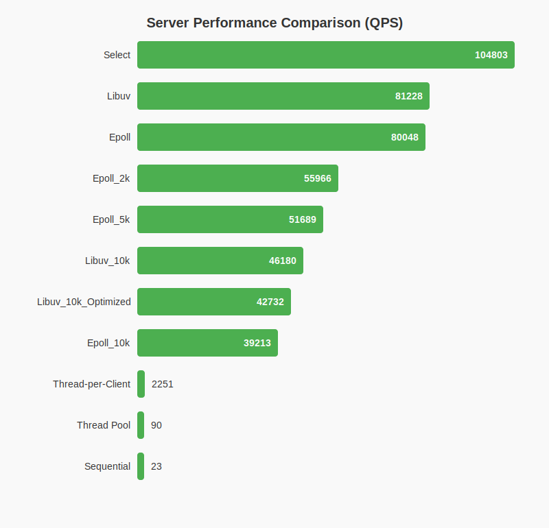

# Concurrent Servers 学习笔记

本项目是跟随 Eli Bendersky 的教程 [Concurrent Servers](https://eli.thegreenplace.net/2017/concurrent-servers-part-1-introduction/) 进行的学习实践。

目标是探索不同的并发服务器模型，从简单的顺序服务器到多线程、事件驱动等高级模型。

## 1. 协议规范 (Protocol)

这是一个简单的有状态协议 (Stateful Protocol)。

### 状态机
1. **连接建立**: 
   - 服务端接受连接。
   - **服务端** -> 发送 `*` 给客户端。
   - 服务端进入 `WAIT_FOR_MSG` 状态。

2. **WAIT_FOR_MSG 状态**:
   - 服务端忽略客户端发送的所有字符，直到收到 `^`。
   - 收到 `^` (由**客户端**发送) -> 服务端进入 `IN_MSG` 状态。

3. **IN_MSG 状态**:
   - 服务端回显 (Echo) 客户端发送的每一个字符，但会将字节值 `+1`。
   - 例如：客户端发 `A` (ASCII 65)，服务端回 `B` (ASCII 66)。
   - 收到 `$` (由**客户端**发送) -> 服务端回到 `WAIT_FOR_MSG` 状态。
   - 注意：`^` 和 `$` 仅作为分隔符，**不会**被回显。

## 2. 进度与编译指南

### 2.1 顺序服务器 (Sequential Server)
*   **代码位置**: `sequential_server/`
*   **特点**: 一次只能服务一个客户端，必须等当前客户端断开连接后才能服务下一个。
*   **编译**:
    ```bash
    cc sequential_server/sequential_server.c utils.c -o sequential_server/sequential_server
    ```
*   **运行**:
    ```bash
    ./sequential_server/sequential_server
    ```

### 2.2 多线程服务器 (Threaded Server)
*   **代码位置**: `threads/`
*   **特点**: 为每个客户端创建一个新线程 (Thread-per-client)。可以同时服务多个客户端。
*   **编译**:
    ```bash
    cc threads/threaded_server.c utils.c -o threads/threaded_server -pthread
    ```
*   **运行**:
    ```bash
    ./threads/threaded_server
    ```
    *验证*: 开启两个终端分别运行客户端，可以看到它们互不干扰。

### 2.3 线程池服务器 (Thread Pool Server)
*   **代码位置**: `thread_pool/`
*   **特点**: 预先创建固定数量的线程（如 4 个），通过任务队列分发连接。避免了频繁创建/销毁线程的开销，防止系统过载。
*   **核心技术**:
    *   **生产者-消费者模型**: 主线程 Accept -> 入队 -> Worker 线程抢锁 -> 出队 -> 处理。
    *   **条件变量**: `pthread_cond_wait` 实现“无任务睡眠，有任务唤醒”。
    *   **循环队列**: 使用 `% queue_size` 实现固定内存的循环复用。
    *   **坑点修复**: 必须 `malloc` 新内存来传递 `sockfd` 参数，防止主线程修改变量导致 Race Condition。
*   **编译**:
    ```bash
    cc thread_pool/thread_pool_server.c thread_pool/thread_pool.c utils.c -o thread_pool/thread_pool_server -pthread
    ```
*   **运行**:
    ```bash
    ./thread_pool/thread_pool_server
    ```

### 2.4 IO 多路复用服务器 (Select Server)
*   **代码位置**: `select_server/`
*   **特点**: **单线程**实现并发。利用 OS 提供的 `select` 系统调用，同时监控多个 Socket 的状态（可读/可写）。
*   **核心技术**:
    *   **非阻塞 IO (Non-blocking IO)**: 必须将所有 Socket 设为非阻塞，防止某个客户端卡死整个线程。
    *   **状态机 (State Machine)**: 因为无法在一个循环里等待完整消息，必须维护每个客户端的 `state` (INITIAL_ACK / WAIT_FOR_MSG / IN_MSG)，逐字节处理。
    *   **输出缓冲区**: `send` 也可能阻塞，所以需要维护 `send_buf`，并监听 `writefds`，在 Socket 可写时再发送。
*   **编译**:
    ```bash
    cc select_server/select_server.c utils.c -o select_server/select_server
    ```
*   **运行**:
    ```bash
    ./select_server/select_server
    ```

### 2.5 Epoll 服务器 (Epoll Server)
*   **代码位置**: `epoll_server/`
*   **特点**: Linux 特有的高性能 IO 复用模型。解决了 Select 的 O(N) 轮询性能问题。
*   **核心优势**:
    *   **O(k) 效率**: 仅处理活跃的 Socket，无需遍历所有连接。
    *   **边缘触发/水平触发**: 本实现使用默认的水平触发 (Level Triggered)。
    *   **动态监听**: 只有在有数据要发送时才开启 `EPOLLOUT` 监听，避免不必要的内核唤醒。
*   **编译**:
    ```bash
    cc epoll_server/epoll_server.c utils.c -o epoll_server/server
    ```
*   **运行**:
    ```bash
    ./epoll_server/server
    ```

### 2.6 Libuv 服务器 (Libuv Server)
*   **代码位置**: `libuv_server/`
*   **特点**: 基于事件循环的异步 I/O 库，是 Node.js 的核心。
*   **核心优势**:
    *   **跨平台**: 在 Linux 上使用 epoll，在 Windows 上使用 IOCP，在 macOS 上使用 kqueue。
    *   **高性能**: 高度优化的事件循环，极大简化了非阻塞 I/O 的编程复杂度。
    *   **异步回调**: 通过回调函数处理 I/O 事件，代码结构清晰。
*   **编译**:
    ```bash
    cc libuv_server/libuv_server.c utils.c -o libuv_server/libuv_server -luv
    ```
*   **运行**:
    ```bash
    ./libuv_server/libuv_server
    ```

## 3. 性能测试总结 (Benchmark)

我们在 Windows Subsystem for Linux (WSL) 环境下，使用 Go 编写的压测工具对上述服务器模型进行了基准测试。

### 3.1 100 并发测试结果

| Server Model | QPS (Req/Sec) | Avg Latency (ms) | P99 Latency (ms) | Errors | 备注 |
| :--- | :--- | :--- | :--- | :--- | :--- |
| **Sequential** | ~22 | 43.98 | 44.29 | High | 单线程阻塞，无法处理并发 |
| **Threaded** | ~2,250 | 44.10 | 48.00 | 0 | 线程开销大，无法扩展 |
| **Thread Pool** | ~90 | 44.03 | 44.30 | High | 线程池太小 (4)，任务排队严重 |
| **Select** | ~104,803 | 0.94 | 2.51 | 0 | 小并发下性能极佳 |
| **Epoll** | ~80,047 | 1.24 | 3.04 | 0 | 高性能，吞吐量稳定 |
| **Libuv** | ~81,228 | 1.21 | 3.25 | 0 | 与 Epoll 性能相当，开发更简单 |

### 3.2 10,000 并发挑战 (C10K)

我们进一步对 **Epoll** 和 **Libuv** 服务器进行了 10,000 并发的极限测试。

*   **Epoll Server**:
    *   **QPS**: ~39,212
    *   **Errors**: ~5,781
    *   **分析**: 成功抗住 10k 连接，但由于系统端口耗尽和 backlog 限制，出现了一定比例的连接失败。QPS 下降是因为连接建立的开销增大。

*   **Libuv Server**:
    *   **QPS**: ~42,731
    *   **Errors**: ~4,763
    *   **分析**: 表现略优于手写的 Epoll，证明了 Libuv 库的优化非常出色。

### 3.3 遇到的问题与解决方案

在进行 10,000 并发测试时，我们遇到了大量的连接错误。经过排查，主要原因是操作系统的资源限制：

1.  **临时端口耗尽 (Ephemeral Port Exhaustion)**:
    *   **现象**: 大量连接处于 `TIME_WAIT` 状态，导致新连接无法分配本地端口。
    *   **解决**: 
        *   开启 TCP 连接复用: `sudo sysctl -w net.ipv4.tcp_tw_reuse=1`
        *   扩大本地端口范围: `sudo sysctl -w net.ipv4.ip_local_port_range="1024 65535"`
        *   缩短 FIN-WAIT-2 超时: `sudo sysctl -w net.ipv4.tcp_fin_timeout=15`

2.  **文件描述符限制 (File Descriptor Limits)**:
    *   **现象**: `accept` 或 `socket` 调用失败，提示 "Too many open files"。
    *   **解决**: 使用 `ulimit -n 20000` 临时提升 shell 的文件描述符限制。

3.  **逻辑死锁 (Logical Deadlock)**:
    *   **现象**: 客户端连接后卡死，没有任何响应。
    *   **原因**: 协议要求服务端先发送 `*` (握手)。但在 Epoll 实现初期，`accept` 后仅注册了 `EPOLLIN` 事件。导致服务端在等待客户端发数据，而客户端在等待服务端发 `*`，形成死锁。
    *   **解决**: 在 `accept` 后立即注册 `EPOLLOUT` 事件，或者直接尝试发送握手包，确保协议状态机能正确流转。

通过上述优化，我们成功在单机 WSL 环境下达成了 **4.2万+ QPS** 的高并发处理能力。

### 3.4 结果可视化 (Visualization)

本项目包含一个 Go 脚本，用于将 CSV 压测结果转换为 SVG 图表。

*   **运行命令**:
    ```bash
    go run plot_results.go
    ```
*   **输出**: 生成 `benchmark_chart.svg`，可直接在浏览器中查看各服务器模型的性能对比。



## 4. 技术展望 (Future Roadmap)

虽然目前的实现已经涵盖了主流的并发模型，但为了追求极致性能和更贴近生产环境，未来计划探索以下方向（作为技术储备）：

*   **Node.js 运行时探究 (Part 6)**:
    *   深入分析 Node.js 是如何绑定 Libuv 的。
    *   理解 JavaScript 单线程模型与底层 C 线程池的交互机制。
*   **零拷贝技术 (Zero-Copy)**:
    *   使用 `sendfile` 或 `splice` 系统调用，减少用户态与内核态之间的数据拷贝，进一步提升吞吐量。
*   **多线程 + Event Loop (One Loop Per Thread)**:
    *   实现类似 Nginx 或 Netty 的架构：主线程负责 Accept，多个 Worker 线程各自运行独立的 Event Loop。
    *   充分利用多核 CPU 优势，打破单线程 Epoll/Libuv 的计算瓶颈。
*   **应用层协议**:
    *   从简单的自定义协议升级为 HTTP/1.1 或 HTTP/2，实现更通用的 Web 服务器。

---
**项目维护者**: [AlannerFranklin](https://github.com/AlannerFranklin)
